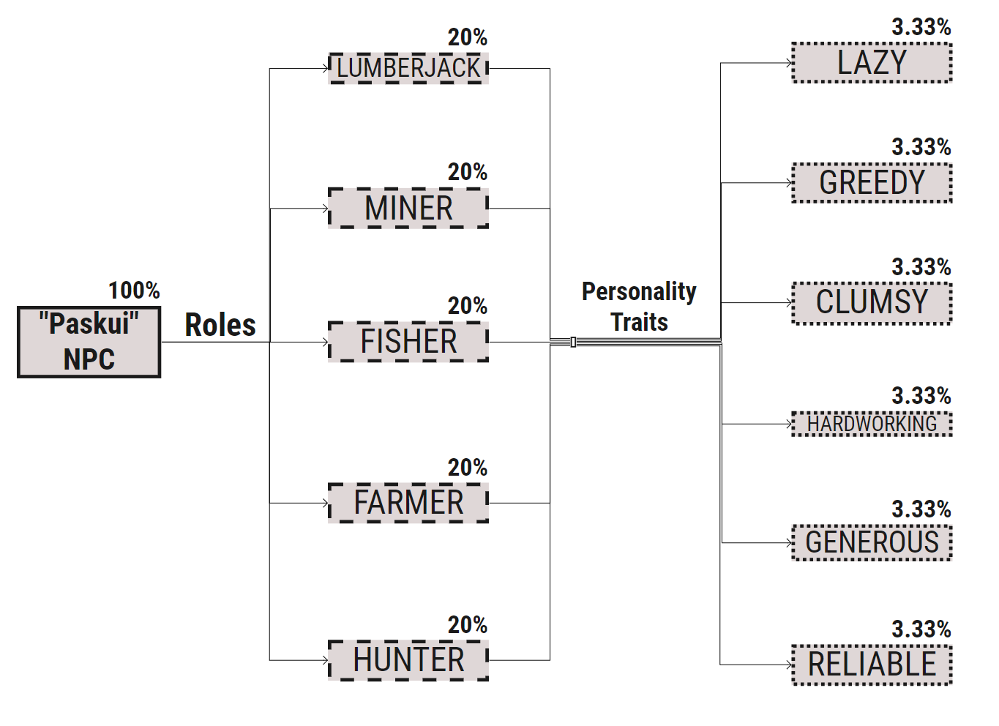

# **Requirements Specification**

## **Project Name:**

‘Woke Village’ Minecraft Java Edition plugin.

## **Purpose:**

Creation of a functional NPC (Non – Playable Character), which would bring more variety into the existing villager system of the game.

## **Summary:**

The NPC would accomplish certain tasks, be hired for resources without having to download additional mods. These NPC's sometimes spawn in vanilla Minecraft villages or by admins executing ‘/npc create ...’ command. The NPC could trade resources based on its role (can only specialize in a single role) for a certain price. This should add some more interesting gameplay for the players while expanding NPC variation.

## **Intended Audience:**

This project is a plugin for a PaperMC server which runs on Minecraft: Jave Edition version 1.17.1. The plugin audience is not specified, but it is suitable for any age group. The project is open-source, which means that others can contribute to it and configure it to their likings.

## **Project Scope:**

The purpose of this NPC plugin is to bring more variety into the NPC system, to make the grind less boring and to provide a broader trading system for the player. We will have a database system in order to store all the necessary data like npc id, inventories, etc. Above all, we hope to provide a comfortable player experience along with the ''help'' option in order to give the user the general knowledge about the plugin.

## **Product Features:**

(Insert ER Diagram here later)

**Operating Environment:**

- Client/server system.
- Oparating system: Windows, macOS, Linux.
- Database: SQLite.

## **Roles and Personalities:**

**Roles:**

Roles are titles, which define what type of resource gathering the NPC will be capable of. There
are five different roles and every NPC will have only one, randomly assigned when it spawns
(Figure 1). Spawn rate of every role is the same and the determining formula is: 
*NPC spawn rate while entering a village (100%) / Number of roles (5) = 20%*

*Figure 1 Role and personality graph*

**Every role in depth:**

- **Lumberjack** - gathers wood-related resources like, Oak Logs, Birch Logs, Spruce Logs,
	Dark Oak Logs, Acacia Logs, and Jungle Logs (amount=128). Another possible service is apple gathering. Since one of the most powerful healing items in the game are golden apples, we have decided that apples are a pretty useful resource, so the lumberjack role will be able to collect them if a player buys that service (amount=64). Lastly, this role will be able to gather various saplings (amount=16).
	
- **Miner** - gathers underground resources, like CobbleStone, Coal and Iron ore.
	If the NPC gets lucky (1/20 chance) while gathering any resource it will bring a random
	amount of Redstone (<20) / Lapis Lazuli (<20) / (1/40 chance) Diamond (<2) / Emerald
	(<2). Every additional resource from getting lucky is unique and does not stack (ex.: the
	NPC cannot get lucky and bring both Redstone and Lapis Lazuli).

- **Fisher** - catches resources from the water, like Raw Cod, Raw Salmon, Tropical Fish, Puffer
	Fish. Other two services however, will be a lot more fun. To try and make the trading process more unique and exciting, we will add a lottery of a sort to the fisher role. When selecting fishing for items or expedition services, the player can either be rewarded greatly, or get an absolutely useless item. For example a player buys the expedition service for 10 gold. Then, when the NPC comes back, the player either gets a name tag (good item) or a leather shoe (junk item).
	
- **Farmer** - gathers crops, like Wheat, Beetroot, Carrot, Potato, Melon, Pumpkin, Sugar
	Cane, Cactus, Mushroom, and Glow Berries. If the NPC gets lucky (1/3 chance), when
	gathering Wheat it will bring a random amount of Wheat Seeds (<10), when gathering
	Melon it will bring a random amount of Melon Seeds (<10), when gathering Pumpkin it
	will bring a random amount of Pumpkin Seeds (<10). (This role will be implemented in the future).

- **Hunter** - gathers wildlife items, like Beef, Pork, Chicken, Rabbit, Rabbit Hide, Leather,
	and White Wool. If the NPC gets lucky (1/15 chance), when hunting Rabbits it will bring
	Rabbit’s Foot (1), when hunting Chicken it will bring a random amount of Feathers (<10)
	or random amount of Eggs (<5). (This role will be implemented in the future).

**Personalities:**

Personalities are permanent modifiers to every NPC, which define certain service buffs
(improvements) or debuffs (deterioration). There are 6 different personality traits and every
NPC will have only one, randomly assigned when it spawns (Figure 5). Spawn rate of every personality trait is the same and the determining formula is: *NPC spawn* *rate while entering a village (100%) / Number of roles (5) / Number of personality traits (6)* *= 3.33%*

**Every personality trait in depth:**

- **Lazy** - takes a random amount of time longer to deliver your order (<240s) (without Lazy or Hardworking trait the base is 500s). Every transaction resets the previous debuff and calculates anew.

- **Greedy** - raises the price for services a random amount (>1x <2x). Every transaction resets the previous debuff and calculates anew.

- **Clumsy** - randomly raises the chance of failure for the NPC (<15%) (without Clumsy or Reliable trait the base is 5%). Every transaction resets the previous debuff and calculates anew.

- **Hardworking** - takes a random amount of time shorter to deliver your order (<240s) (without Lazy or Hardworking trait the base is 500s). Every transaction resets the previous debuff and calculates anew.

- **Generous** - lowers the price for services a random amount (>0.5x <1x). Every transaction resets the previous debuff and calculates anew.

- **Reliable** - randomly lowers the chance of failure for the NPC (<=5%) (without Clumsy or Reliable trait the base is 5%). Every transaction resets the previous debuff and calculates anew.

## **Functional Requirements:**

NPC Roles:

- NPCs have different roles and personalities.
- One NPC can only have one role and personality.
- The personalities are generated randomly via RNG.
- The personality will be specified in the GUI.
- The role will be specified above the NPC.
- Differnet personalities must have different outcomes for the trade process.
- Different roles must do different jobs.

Must Have Features:

- The plugin must run on these operating systems: Windows, Linux, macOs.
- The console user must use the -l flag when executing npc spawn command.
- The player must not be able to take out the items out of the GUI.
- The NPC should be reloaded back into the server after a server restart.
- The NPC must be deleted from the data file after remove commands/after death.
- The NPC must be killable.
- NPCs must have different roles and personalities which would affect the trading system.
- The plugin must work on Minecraft: Java Edition version 1.17.1.
- The NPC must simulate resource gathering while it is working.
- The NPC must be invincible while a player interacts with it.

Installation:

- Installation is really simple and quick.
- It requires only simple computer knowledge.
- No additional software needed in order to install the plugin.
- The installation does not require any permissions.
- To check if the plugin was installed look at the servers terminal.

Spawning / Removing:

- The NPC must spawn when a player executes /npc create command.
- The NPC can also be spawned via the console using the /npc create -l command.
- The NPC can also spawn in a random village (One NPC per village). (TBD).
- The NPC can have a custom name with a /npc create -n command.
- The NPC can be spawned with a specific role or personality while using the -r and -p flags.
- The NPC can be removed with the /npc remove command.
- To remove a certain NPC it is possible to use the /npc remove id command.
- To remove all the NPCs it is possible to use the /npc removeAll command.

Interaction:

- Players can interact with the NPC by right clicking it.
- A simple to use inventory-like menu.
- Pick a service by pressing on it.
- Receive the goods into the inventory.
- NPC must stop while a player is interacting with it.
- NPC must always have the same service menu.
- A "help" option with basic information is available at the interaction menu.

**Illustration of Interaction**

Gathering:

- The gathering is done by the NPC itself.
- The NPC uses "Minecraft" built-in navigation functions walk to the required material.
- The NPC uses "Minecraft" destroy block mechanics to destroy that material.
- The NPC has a certain timer (depends on the role) to finish the gathering.
- Invisibility is used to simulate going really far away from the player.
- If no specific material is found nearby, the NPC goes further and becomes invisible.
- Collision is turned off for the NPC in order to not get pushed around while working.
- The NPC takes no damage while it is gathering (To make it more fair).
- If the NPC gets stuck in water it should teleport back when the timer runs out.
- The NPC takes the material to the player and ends the transaction.

Process:

- Very easy to use, does not require any confusing actions.
- The prices of the services are shown when a user hovers on the service.
- After paying all the user needs to do is just wait for it to come back.
- Once the NPC is back, the player receives the resources and the transaction ends.
- If the NPC loses the items during the process, the player won't get a refund.

Uninstallation: 

- As simple as the installation part.
- All the user needs to do it just delete the plugin file.
- To avoid any unnecessary bugs or glitched NPCs it is also recommended to delete the data.yml file as well as the entities files located in world\entities directory.

## **Non-Functional Requirements:**

Availability:

- The plugin should be available for every user who connects to the server.
- The plugin should not require any other additional software or file.

Maintainability:

- The plugin should be maintained by the developers or other contributors who decide to work on the project as well.
- The release version should be changed once updated.

Usability:

- The plugin should satisfy a maximum number of players.
- The plugin is free-to-use for everyone.
- The plugin should be easy to use for all age gaps.
- The plugin should not have any confusing commands or parts.

Performance: (How fast does the system return results? How much will this performance change with higher workloads?)

- Relatively weak servers (1 GB of RAM) should have no problem dealing with the plugin.
- 300 (non-working) NPCs resulted in 20 TPS (which is just perfect for a "Minecraft" server).

Compatibility:

- Minecraft: Java Edition (version 1.17.1) game client.
- PaperMC (version 1.17.1) server client.
- Java 16 (or OpenJRE 16, or OpenJDK 16).
- Gradle (version 7.1.1 or higher).

Security:

- The plugin does not collect any information of it's user.

