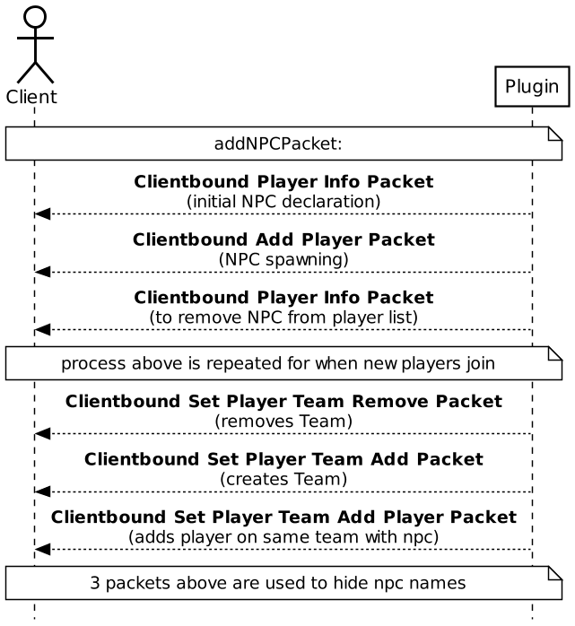



# **''Woke Village'' Technical specification**

"Woke Village" introduces a collection of active NPCs. They are ordinary mortal creatures, with
health and hunger stats, further on they can have one of five roles and every role has the same
rotation of random personalities. These villagers rarely spawn in villages and can roam around the
world providing gathering services for the player. They can gather every basic resource in bulk,
but contrary to Minecraft villagers, they actually walk to their desired resource, take time to gather
it and then come back to the place where the deal happened and give those resources to the player.
We strived to create an easily accessible addition to the game, which would not force the player to
download external files. To enable the plugin, only the servers creator would require installing it
before launch and other player could just join and start playing without any issues.

## **System context:**

Our plugins environment mainly consists of three entities.

*Users* – the users are the most significant part of the project. Our plugin is designed to
communicate with the user via the ‘’Minecraft’’ in game chat and the NPC menu. Spawning
in the NPC requires using the spawn command, which is typed into the game chat. In
addition, in order to interact with the NPC, the user will have to use the inventorylike menu,
which appears once you right click on the NPC.

*Data.yml* – this is our main data storage for now, however, later on we are planning to use
SQLite for out data storage. This data file saves all the necessary data, which is required in
order to save the NPC and to reload it back into the server. This data includes the NPCs
location, UUID, skin, signature, etc.

*Paper.jar* – this is the game server, which our plugin depends on. The game server launches
the plugin and has all the necessary dependencies in order for the plugin to function as well.
These dependencies include: *io.papermc:paper-api, org.bukkit, org.spigot and *net.minecraft.server.*

*Figure 1 System Context*

## **Deployment:**

This project is built on more dependencies, than a regular one, because we are adding functionality
"on top" of an already existing project. In the graph (Figure 2, Graph section), we can see the
services we use. The Minecraft: Java Edition game server (later Paper) is configured and ran by
the game administrator using Paper.jar file on which this project (WokeVillage.jar) depends on
and is launched by. Paper looks for plugins folder, located in the server files directory, in which
our plugin will be installed and using JavaPlugin interface, Paper will launch it.

*Figure 2 Deployment diagram*

## **NPC Interaction (Figure 3, Graph section):**

*Figure 3 Interaction diagram*

Start means either spawning in an NPC (*/npc create*) or finding him in the wild. After this, you can
right click him (*PlayerUseUnknownEntityEvent*) to open the menu (Figure 4). Then the player can
either close it or pick a service. If a player decides to pick a service, he/she can then pay the NPC
(*player.getInventory().remove(Material)*) and wait the given time. After the time passes, the player
can finally receive their goods and end the transaction.

*Figure 4 NPC Menu*

## **Connection Packets:**

The Minecraft: Java Edition server accepts connections from TCP (transmission control protocol) clients and communicates with them by using packets. A packet is a sequence of bytes sent over the TCP connection. The packets are responsible for nearly everything the player does, interacts, or sees on the server. So in order to spawn the NPC, make it visible to every player on the server, to make him interact able and so on, we had to implement packet sending. In the graph (Figure 6, Graph section) an NPC, spawning via packets is shown. In order to add an NPC packet, we need to send three different packets to the Client. These include the *Player Info* (two times with different parameters), *Add Player* packets. In order to make them visible to all the players online, the server needs to repeat sending these packets for every new player who joins. In order to hide the NPC nametag we need three other packets: *Set Player Team Remove, Set Player* *Team Add and Set Player Team Add Player packets.*

*Figure 6 NPC Spawning via Packets*

## **Command Execution (Figure 7, Graph section):**

*Figure 7 Command Lifecycle*

Command execution splits into three different functions - *onEnable()*, *registerCommands()* and *onCommand()*.

- **onEnable()** - is responsible for everything that happens once the server is started. Initiates all the previous tasks as well as executes the *registerCommands()* function.

- **registerCommands()** - creates an instance of the *CommandManager* class which is responsible for all the commands of the plugin by using the *new CommandManager()* call. Injects the new command manager and registers a command class (*NPCCommands*) for it.

- **onCommand()** - is responsible for everything that happens when a command is executed. Combines all the arguments into one class and passes them for the execution. Then, if no exception is caught, executes the command and returns true. Otherwise, it informs the user about the bad command input and returns false, thus not executing the command.

## **Technologies and tools:**

- **Coding language:** Java (version 16).

- **Build tool:** Gradle (Minimum required version is 7.1.1).

- **IDE:** IntelliJ IDEA.

- **Data storage:** SQLite.

