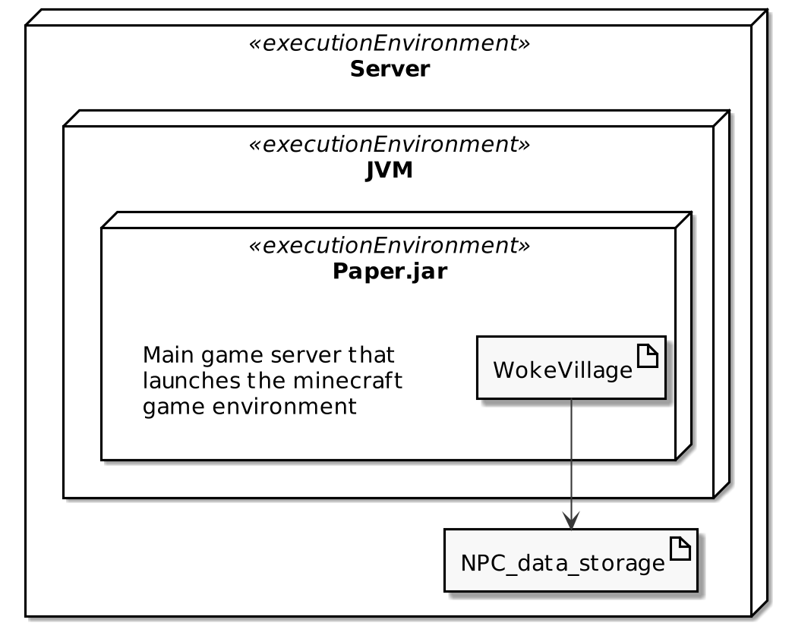
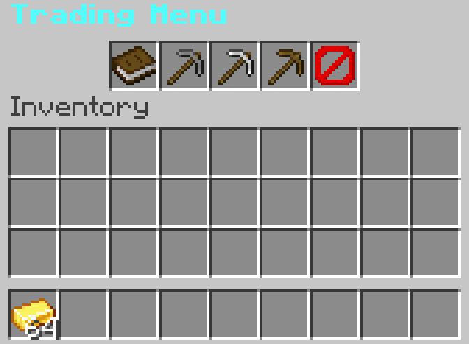

# **''Woke Village'' Technical specification**

"Woke Village" introduces a collection of active NPCs. They are ordinary mortal creatures, with
health and hunger stats, further on they can have one of three roles (more will be added later) and every role has the same
rotation of random personalities. These villagers rarely spawn in villages and can roam around the
world providing gathering services for the player. They can gather every basic resource in bulk,
but contrary to Minecraft villagers, they actually walk to their desired resource, take time to gather
it and then come back to the place where the deal happened and give those resources to the player.
We strived to create an easily accessible addition to the game, which would not force the player to
download external files. To enable the plugin, only the servers creator would require installing it
before launch and other player could just join and start playing without any issues.

## **System context:**

Our plugins environment mainly consists of four entities.

*Admin* – the administrators are the most significant part of every "Minecraft" server. Spawning
in the NPC requires using the spawn command, which is typed into the game chat and can only be accessed by an administrator. In addition, they can also remove the NPCs by using the remove or removeAll commands.

*Database* – Our main data storage is .yml file for now, however, later on we are planning to use
SQLite for our data storage. This data file saves all the necessary data, which is required in
order to save the NPC and to reload it back into the server. This data includes the NPCs
location, UUID, skin, signature, etc.

*PaperMC Server* – this is the game server, which our plugin depends on. The game server launches
the plugin and has all the necessary dependencies in order for the plugin to function as well.
These dependencies include: *io.papermc:paper-api, org.bukkit, org.spigot and *net.minecraft.server.*

*Commands* - these are the commands mentioned in the Admin section. They can be used in order to create the NPCs or to remove them from the world. These commands also have some additional flags like: -l (location), -r (role), -p (personality) and -n (name) which are all required in order to create the NPC in a certain location, with a certain name and etc.

*Figure 1 System Context*

## **Deployment:**

This project is built on more dependencies, than a regular one, because we are adding functionality
"on top" of an already existing project. In the graph (Figure 2), we can see the
services we use. The Minecraft: Java Edition game server (later Paper) is configured and ran by
the game administrator using Paper.jar file on which this project (WokeVillage.jar) depends on
and is launched by. Paper looks for plugins folder, located in the server files directory, in which
our plugin will be installed and using JavaPlugin interface, Paper will launch it.

*Figure 2 Deployment diagram*

## **NPC Interaction (Figure 3):**

*Figure 3 Interaction diagram*

Start means either spawning in an NPC (*/npc create*) or finding him in the wild. After this, you can
right click him (*PlayerUseUnknownEntityEvent*) to open the menu (Figure 4). Then the player can
either close it or pick a service. If a player decides to pick a service, he/she can then pay the NPC
(*player.getInventory().remove(Material)*) and wait the given time. After the time passes, the player
can finally receive their goods and end the transaction.

*Figure 4 NPC Menu*

## **Command Execution (Figure 5):**

*Figure 5 Command Lifecycle*

Command execution splits into three different functions - *onEnable()*, *registerCommands()* and *onCommand()*.

- **onEnable()** - is responsible for everything that happens once the server is started. Initiates all the previous tasks as well as executes the *registerCommands()* function.

- **registerCommands()** - creates an instance of the *CommandManager* class which is responsible for all the commands of the plugin by using the *new CommandManager()* call. Injects the new command manager and registers a command class (*NPCCommands*) for it.

- **onCommand()** - is responsible for everything that happens when a command is executed. Combines all the arguments into one class and passes them for the execution. Then, if no exception is caught, executes the command and returns true. Otherwise, it informs the user about the bad command input and returns false, thus not executing the command.

## **Case Testing:**

**Random NPC Role generation**

An administrator of the server should be able to spawn multiple types of NPC roles with one command.

Precondition: The server, in which the player is connected to has the "Woke Village" plugin.

Assumption: The player typing the "/npc create" command is administrator of the server.

Test steps:
1. Press "T" to open in-game chat
2. Type "/npc create" command
3. Open their inventory to check their role, based on their available tasks

Expected result:

After performing this test multiple times, the player should encounter different NPC roles, however randomization can cause the same role to spawn multiple times in a row.

**Random NPC Personality generation**

An administrator of the server should be able to spawn multiple types of NPC personalities with one command.

Precondition: The server, in which the player is connected to has the "Woke Village" plugin.

Assumption: The player typing the "/npc create" command is administrator of the server.

Test steps:
1. Press "T" to open in-game chat
2. Type "/npc create" command
3. Open their inventory to check their personality, based on the text above the NPC trading inventory.

Expected result:

After performing this test multiple times, the player should encounter different NPC personalities, however randomization can cause the same personality to spawn multiple times in a row.

**Functional "Lazy", "Hardworking" personalities**

The NPC must be faster at gathering, when the NPCs personality is "Hardworking" and slower at gathering, when the NPCs personality is "Lazy".

Precondition: The server, in which the player is connected to has the "Woke Village" plugin.

Assumption: The player has access to an NPC with "Lazy", "Hardworking" personalities, has enough resources to pay the NPC for the transaction.

Test steps:
1. Check if the NPC has "Lazy" or "Hardworking" personality
2. Perform a successful transaction to the NPC via trading menu services
3. Set a timer when the transaction is completed. Stop the timer when the NPC comes back with gathered goods

Expected result:

If the NPC has "Lazy" personality, it will come back within 750s-1000s.
If the NPC has "Hardworking" personality, it will come back within 250s-500s

**Functional "Generous", "Greedy" personalities**

The NPC must have cheaper prices, when the NPCs personality is "Generous" and more costly prices, when the NPCs personality is "Greedy".

Precondition: The server, in which the player is connected to has the "Woke Village" plugin.

Assumption:   The  player  has  access  to  an  NPC  with  "Generous",  "Greedy"  personalities,  has enough resources to pay the NPC for the transaction.

Test steps:
1. Check if the NPC has "Generous" or "Greedy" personality
2. Perform a successful transaction to the NPC via trading menu services
3. Check how much gold has been deducted from your inventory

Expected result:

If the NPC has "Greedy" personality, it will take up to 200% of the price from the player.
If the NPC has "Generous" personality, it will take down to 50% of the price from the player.

**Functional “Clumsy”, “Reliable” personalities**

The NPC must never fail to deliver its resources, when the NPCs personality is "Reliable" and have 15% chance to fail at gathering, when the NPCs personality is "Clumsy".

Precondition: The server, in which the player is connected to has the "Woke Village" plugin.

Assumption: The player has access to an NPC with "Clumsy", "Reliable" personalities, has enough resources to pay the NPC for the transaction.

Test steps:
1. Check if the NPC has "Clumsy" or "Reliable" personality
2. Perform a successful transaction to the NPC via trading menu services

Expected result:

Repeat the test multiple times, to increase data sample-size.
If the NPC has "Reliable" personality, it will never fail to deliver the goods.
If the NPC has "Clumsy" personality, it will fail 15% of the time (up from 5% base chance).

**Commands – Remove Command**

A server administrator should be able to use the NPC remove command.

Precondition: The server, in which the player is connected to has the "Woke Village" plugin.

Assumption: A server administrator should be able to use the NPC remove command.

Test steps:
1. Press "T" to open the games chat window.
2. Type in the command "/npc remove".
3. Press "Enter" to submit the command.

Expected result:

The command gets executed and the latest spawned NPC is removed.

**Commands – Create Command**

A server administrator should be able to use the NPC remove command.

Precondition: The server, in which the player is connected to has the "Woke Village" plugin.

Assumption: The command sender has administrator privileges.

Test steps:
1. Press "T" to open the games chat window.
2. Type in the command "/npc create".
3. Press "Enter" to submit the command.

Expected result:

The command gets registered and the NPC is spawned near the command sender.

**Commands – Remove All Command**

A server administrator should be able to use the NPC remove all command to remove all the NPC from the world.

Precondition: The server, in which the player is connected to has the "Woke Village" plugin.

Assumption: The command sender has administrator privileges and at least one NPC is present in the world.

Test steps:
1. Press "T" to open the games chat window.
2. Type in the command "/npc removeAll".
3. Press "Enter" to submit the command.

Expected result:

The command gets executed and all the NPC are removed from the world.

**Commands – Command Flags**

A server administrator and the server console user should be able to use command flags to pass additional arguments when spawning the NPC.

Precondition: The server, in which the player is connected to has the "Woke Village" plugin.

Assumption:  The command sender has administrator privileges or is a console user, and at least one NPC is present in the world.

Test steps
For player instance:
1. Press "T" to open the games chat window.
2. Type in the command "/npc create -n (name) -l (location) -r (role) -p (personality)".
3. Press "Enter" to submit the command.

For console instance:
1. Open up the console.
2. Type in the command "npc create -n (name) -l (location) -r (role) -p (personality)". (Console must use -l flag).
3. Press "Enter" to submit the command.

Expected result:

The command gets executed and the NPC is spawned with the given name or/and at the given location or/and has the required role/personality.

**Data Management – Data Saving**

The NPC data should be written into a document on NPC spawn.

Precondition: The server, in which the player is connected to has the "Woke Village" plugin.

Assumption: There is at least one administrator who can execute the commands.

Test steps:
1. Execute NPC create command.
2. Check if the NPC was spawned.
3. See if there is data in the data.yml file.

Expected result:

The NPC data (name, location, UUID, role, personality) is shown in the data.yml file.

**Data Management – Data Loading** 

The NPC data should help to reload the NPC back into the server.

Precondition: The server, in which the player is connected to has the "Woke Village" plugin.

Assumption: The data.yml file is not empty.

Test steps:
1. Restart the server.
2. Log in to the server.
3. Check if all the NPCs are present.

Expected result:

After server restart, the NPCs should be present in the server.

**Data Management – Data Deleting**

The NPC data should be deleted once the NPC is removed.

Precondition: The server, in which the player is connected to has the "Woke Village" plugin.

Assumption:  There is at least one administrator who can execute the commands, the data file is not empty.

Test steps:
1. Execute the NPC remove or remove all commands.
2. Check if NPC/NPCs were removed.
3. Look at the data.yml to see if the data was removed.

Expected result:

The NPC data (name, location, UUID, role, personality) is removed from the data.yml file.

**Opening the trading inventory**

A standard player should be able to open the NPCs trading inventory.

Precondition: The server, in which the player is connected to has the "Woke Village" plugin.

Assumption: "Woke Village" plugin NPC is standing right in front of the player.

Test steps:
1. Place in-game cursor within the hit-box of the trading NPC
2. Right-click your mouse, while the cursor is on the NPC

Expected result:

A menu pops out, displaying
1. "Help" button in the first trading slot.
2. Three items representing trading tasks are in the next three slots.
3. "Close" button in the last trading slot.

**Successful transaction**

A standard player should be able to successfully complete a transaction with the NPC.

Precondition: The server, in which the player is connected to has the "Woke Village" plugin.

Assumption: "Woke Village" plugin NPCs trading inventory can be opened, the player has enough resources to purchase traders goods.

Test steps:
1. Search for desired role of the NPC (ex.: for wood gathering, search for a "Lumberjack")
2. Select one of three available tasks

Expected result:

1. A musical note will be played indicating the successful pay of the deal.
2. In-game chat displays a message: "You have bought villagers services!".
3. NPC starts pathfinding to desired resource.

**Immovable menu items**

A player should not be able to tamper (remove, duplicate, change) with trading menus items.

Precondition: The server, in which the player is connected to has the "Woke Village" plugin.

Assumption: "Woke Village" plugin NPCs trading inventory is opened.

Test steps:
1. Drag the menus item away
2. Shift-click the menu item
3. Put items in the trading menu
4. Switch menus items places

Expected result:

Items in the trading menu will not disappear/change/duplicate. They will remain in their starting places and the player will not be able to drag them to its inventory.

## **Technologies and tools:**

- **Coding language:** Java (version 16).

- **Build tool:** Gradle (Minimum required version is 7.1.1).

- **IDE:** IntelliJ IDEA.

- **Data storage:** SQLite. (To be implemented).

