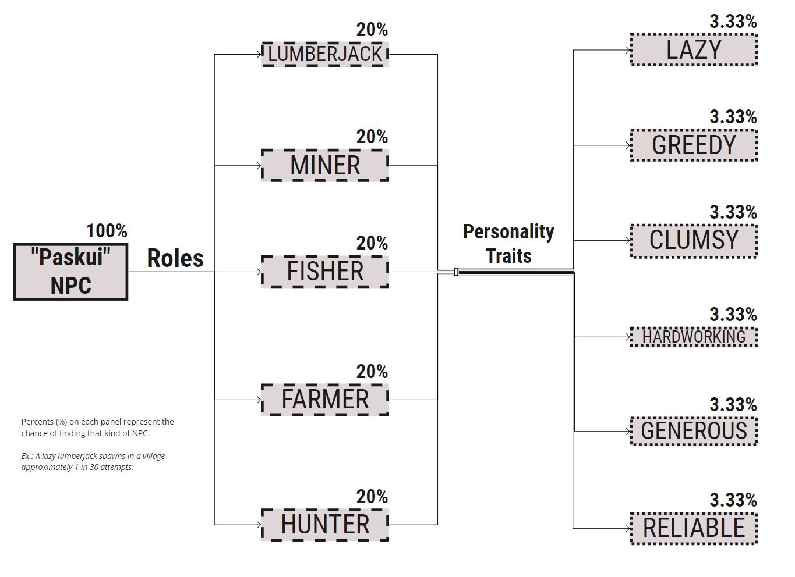
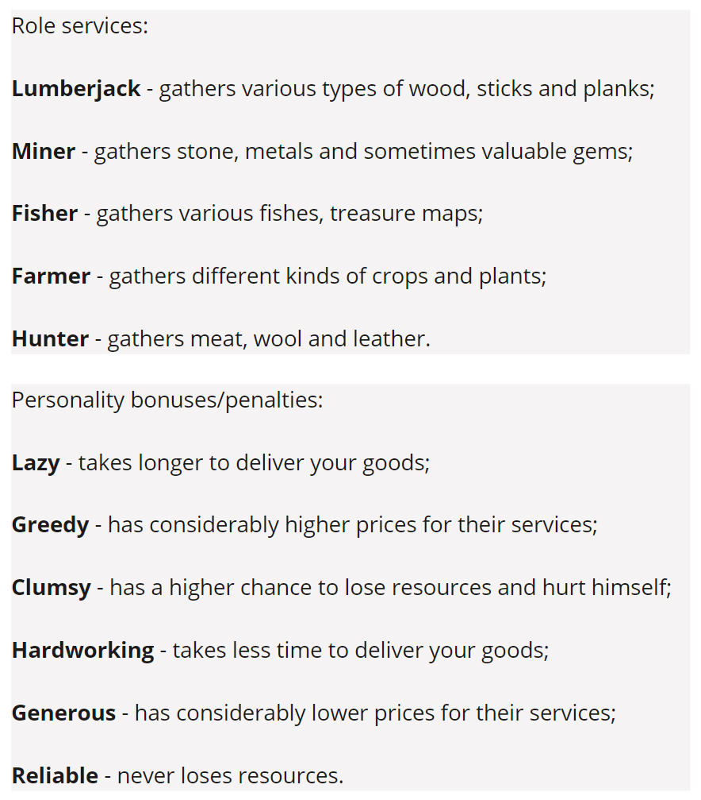

<h1> Documentation of "Paskui Solutions" plugin </h1>
All the information you need to know about this project.

Full Description:
-
Our main goal is creation of a functional NPC (Non Playable Character) plugin in “Minecraft: Java Edition”, using our developed “PaperMc” server API. These NPC's sometimes spawn in vanilla Minecraft villages and can provide great amounts of resources for a certain price. This feature saves the players time and prevents the need of grinding, while the game itself becomes a more relaxed experience and still remains challenging. 

NPC's have roles and personalities.   

Roles determine what type of resource the NPC will be willing to gather, which further decreases the chance of the player to accidentally stumble upon the needed NPC. This encourages traveling and adventuring instead of grinding resources.
Further more they have personality traits, some of them generous, some of them lazy, which will impact the loot you get from their gatherings and the time it takes for them to complete the task (see pciture above).

Setup
-
These are instructions on how to build this project yourself:

1. Clone this repo with `git clone https://git.mif.vu.lt/paskui/paskui-projektas.git`;

**NOTE:**

Alternatively you can run `git clone https://git.mif.vu.lt/paskui/paskui-projektas.git` and then run `git submodule update --init --recursive`.

And before building or editing source code, must run `./gradlew compilePaper`.

**(Work currently only on `paper-nms` branch)**

2. Run `./gradlew build` or `./gradlew jar` to get jar file compiled or just open the folder where the source was cloned with IntelliJ IDEA or other preferred IDE.

Issue Tracker:
-
Visit our [Git Issue Tracker](https://git.mif.vu.lt/paskui/paskui-projektas/-/issues)

Contribution:
-
Our team is not open for internal contribution until further notice.

Licensing:
- 
Copyright 2021, "Paskui Solutions"

Copying and distribution of this file, with or without modification, are permitted in any medium without royalty, provided the copyright notice and this notice are preserved. This file is offered as-is, without any warranty.

— GNU All-permissive License[[1]](https://www.gnu.org/licenses/license-list.html#GNUAllPermissive)[[2]](https://www.gnu.org/prep/maintain/html_node/License-Notices-for-Other-Files.html)

FAQ:
-
- What are the supported minecraft versions?

 Currently this plugin will support 1.17.1 with a prospect to support older versions in the future. 

- How can I access the NPC interface?

 Right click the NPC with your hand. 

- Is it possible to modify the plugin? 

 Yes, this plugin is open source and it is possible to modify it to your liking. 

- Can I change what skin an NPC has? 

 Current;y this functionality is unavailable. 

Contacts:
-
If you have any questions regarding this product, contact paskuisolutions@gmail.com.

Versions:
-
0.1 Added inventory-like GUI.   
0.2 Added static NPC. 
0.3 Added GUI to NPC when right-clicked. 

