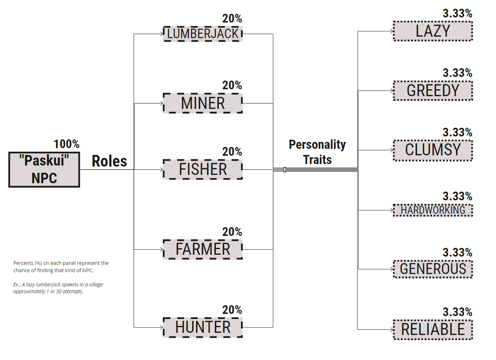

# Minecraft" Plugin from "Paskui Solutions"

Plugin for adding extra Villager NPC types while running on PaperMC/Paper.

### Table of Contents

1. [Description](#description)
1. [System Requirements](#system-requirements)
1. [For Admins](#for-admins)
   - [Instalation](#instalation)
   - [Guide](#guide)
   - [FAQ](#faq)
1. [For Developers](#for-developers)
   - [Build Instructions](#build-instructions)
   - [Issue Tracker](#issue-tracker)
   - [Contribution](#contribution)
1. [Licensing](#licensing)
1. [Contact](#contact)

## Description

Our main goal is creation of a functional NPC (Non Playable Character) plugin for
“Minecraft: Java Edition”, using “PaperMC” server API. These NPC's sometimes spawn
in vanilla Minecraft villages or by admins executing `'/npc create ...'` command
and the NPC could trade resources based on its role (can only specialise in a signle
role) for a certain price. This should add some more interesting gameplay for the
players while expanding NPC variation.

NPC's have roles and personalities.

Roles determine what type of resource the NPC will be willing to gather, which further
decreases the chance of the player to accidentally stumble upon the needed NPC. This
encourages traveling and adventuring instead of grinding resources.

Further more they have personality traits: some of them may be generous, while others
might be lazy, which will impact the loot you get from their gatherings and the time
it takes for them to complete the task.

## For Admins

### Preconfiguration

1. Java 16 (or OpenJRE 16, or OpenJDK 16).

> Usually **Minecraft: Java Edition** min requirement is Java 1.8,
> but after 1.17 version **Mojang** switched over to Java 16.

2. Download and setup [**PaperMC**](https://github.com/PaperMC/Paper) jar file
    while following it's instructions.

> It extends [**Minecraft: Java Edition**](https://minecraft.fandom.com/wiki/Java_Edition)
> server software which is developed by **Mojang Studios** and allows support of vanilla
> (unmodified **Minecraft: Java Edition** game) clients to connect and play over the
> internet with other players.

These requirements also apply for developers too.

### Instalation

1. Download the `'.zip'` file from "Paskui Solutions";
2. Extract the `'.zip'` file;
3. Copy the `'.zip'` file, that got extracted from `'.zip'` into the servers "/plugins" directory.

### Guide

1. Find an NPC in a village (Admins can use `'/npc'` command to spawn immediately);

> Currently spawning mechanic is **not implemented** and `'/npc'` only spawns **in the location**
> of the player that is **logged** in to the server.

2. Right click on NPC to open inventory-like interface;

3. Find a job you want done and check its price right next to the job;

4. Get the required items (NPC's job price) and click on the job;

5. Wait for your items to be shipped into your inventory.

> Steps 3-5 are planned to be implemented in later version
> (current version is v0.2 in `'dev'` branch).

### FAQ

Q: What are the supported minecraft versions?

A: Currently this plugin supports 1.17.1 with a prospect to support older
versions in the future.

 
Q: How can I access the NPC interface?

A: Right click the NPC with your hand.

 
Q: Is it possible to modify the plugin?

A: Yes, this plugin is open source and it is possible to modify it to your liking.

 
Q: Can I change what skin an NPC has?

A: Currently this functionality is unavailable.

## For Developers

### Build Instructions

1. Clone this repo with `git clone https://git.mif.vu.lt/paskui/paskui-projektas.git`;

2. Run `./gradlew build` or `./gradlew jar` to get jar file compiled or just open the folder where the source was cloned with IntelliJ IDEA or other preferred IDE.

### Issue Tracker

Visit our [Git Issue Tracker](https://git.mif.vu.lt/paskui/paskui-projektas/-/issues)

### Contribution

If you find bugs or though of a feature that might suite the plugin, feel free to write an issue.
Our team will review it.

## Contacts

If you have any questions regarding this product, contact paskuisolutions@gmail.com.

## Licensing

Copyright 2021, "Paskui Solutions"

Copying and distribution of this file, with or without modification, are permitted in any medium without royalty, provided the copyright notice and this notice are preserved. This file is offered as-is, without any warranty.

- GNU All-permissive License
[[1]](https://www.gnu.org/licenses/license-list.html#GNUAllPermissive)
[[2]](https://www.gnu.org/prep/maintain/html_node/License-Notices-for-Other-Files.html)
